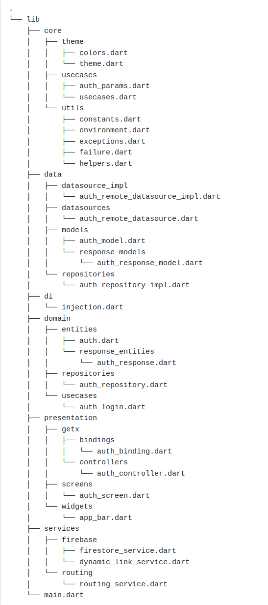

# Flutter MVVM Clean Architecture

#Folder Structure: 

#Features of the app:
1. Authentication :- Auth Screen and functionality 
2. Contacts :- Get Contacts, select contact 
3. Chats - One to one and group chats with all type messages(text, images, video, audio, file)
4. Online Status :- online status according to mobile activity 
5. Reply messages :- Reply to messages by left and right swipes 
6. Redirect to replied messages  
7. Read status :- Mark as seen messages
8. Stories :- put stories and view ( auto and manual both scroll functionality)
9. Calling - video (one to one and group VC)
10. Notifications -  storing and showing in UI and notifying

#Tech Used : 
1. Flutter & Dart
2. Firebase
3. FCM
4. Agora
5. GetX

#Apk link : https://drive.google.com/file/d/1GzfgU6cB_E3y8WsnPcKCK3JHk8TnUXTw/view?usp=drive_link
